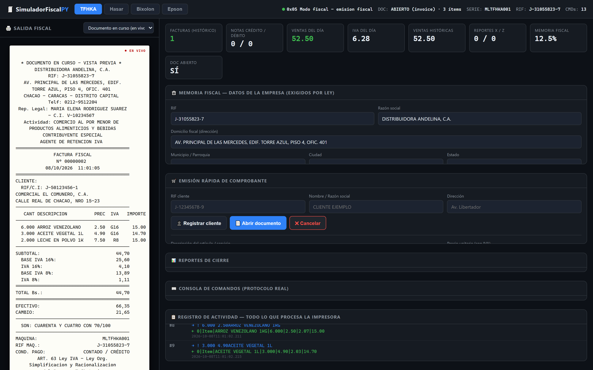
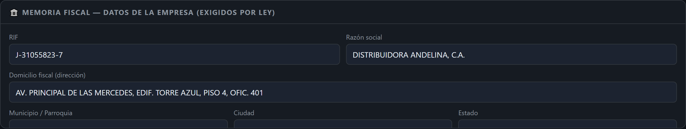
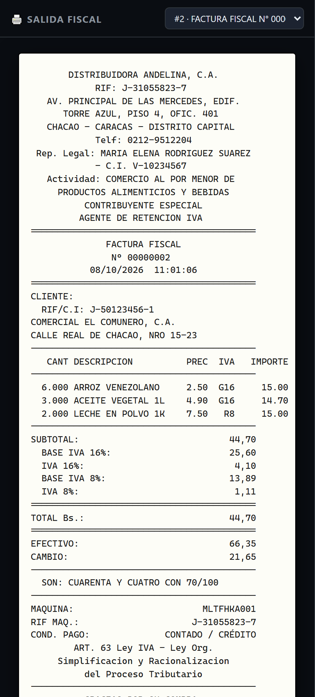
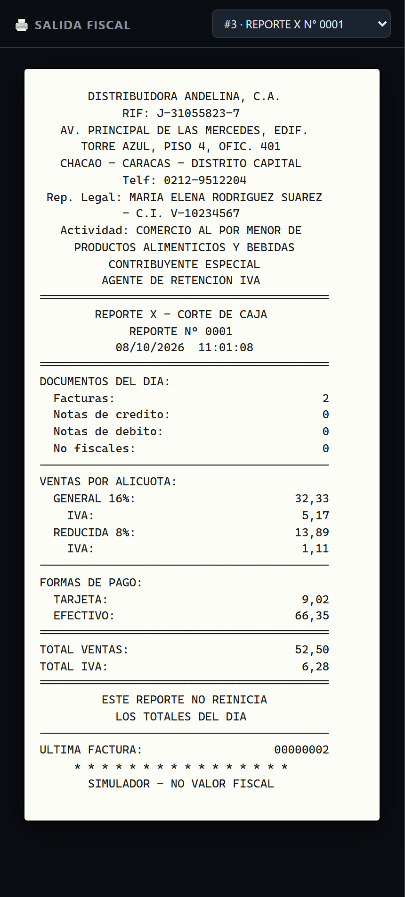
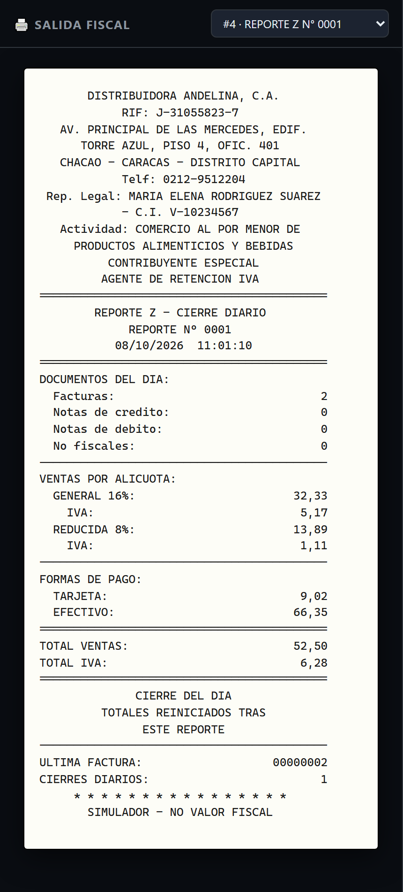
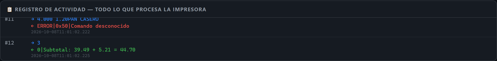

# SimuladorFiscalPY

Simulador de impresoras fiscales para Venezuela, escrito en Python. Soporta las marcas TFHKA, Hasar SMH/P-615F, Bixolon SRP-270 y Epson TM2000, con panel web, memoria fiscal programable, papel virtual y reportes X/Z.

**Licencia:** MIT — ver [LICENSE](LICENSE).

---

## Capturas del panel

### Panel principal



Vista general del panel: a la izquierda la **salida fiscal** (papel virtual con vista previa en vivo del documento en curso) y a la derecha los contadores del día, los del histórico y las tarjetas de estado. Arriba se elige la marca simulada (TFHKA / Hasar / Bixolon / Epson), cada una con su propio estado persistido.

### Memoria fiscal (datos de la empresa)



Formulario con los datos que exige la ley y que la máquina guarda en su memoria fiscal: RIF, razón social, domicilio, municipio/ciudad/estado, teléfono, representante legal + cédula, actividad económica, contribuyente especial y agente de retención. Al programarlos, aparecen en el **encabezado de toda factura, nota y reporte** impresos.

### Factura fiscal impresa



La factura tal como la imprime la máquina: encabezado legal, cliente, tabla de ítems con la alícuota de cada uno (G16 / R8 / exento), desglose de IVA por alícuota, total, forma de pago con vuelto y el **monto en letras**. Se genera con los comandos reales del protocolo de la marca seleccionada.

### Reporte X (corte de caja)



Reporte de lectura: muestra los totales del día (documentos, ventas por alícuota, IVA y formas de pago) **sin reiniciarlos**. Sirve para cuadrar caja a mitad de turno.

### Reporte Z (cierre del día)



Cierre fiscal del día: mismos totales que el X, pero **reinicia los acumulados diarios**. Los contadores históricos (facturas consecutivas y ventas totales de por vida) se conservan.

### Registro de actividad



Log en vivo de todo lo que procesa la impresora: cada comando con su respuesta, en el protocolo real de la marca seleccionada. Útil para depurar integraciones y ver exactamente qué viaja por el puerto.

---

## Panel web (recomendado)

```bash
python panel.py                    # http://127.0.0.1:8080
python panel.py --port 9000
python panel.py --host 0.0.0.0 --port 8080 --no-browser
```

El panel muestra, en una sola ventana:

- **Salida fiscal (lado izquierdo):** el papel virtual con la factura/nota/reportes tal como los imprimiría la máquina, con encabezado legal (RIF, razón social, domicilio, representante, actividad económica), desglose de IVA por alícuota, monto en letras y pie de ley. Mientras el documento está abierto se ve una **vista previa en vivo**.
- **Registro de actividad:** todo lo que procesa la impresora, comando por comando con su respuesta.
- **Memoria fiscal:** los datos que exige la ley; al programarlos aparecen en el encabezado de todo documento impreso (S8E).
- **Emisión rápida:** cliente, ítems con alícuota, subtotal, pago, cierre — genera los comandos reales del protocolo de cada marca.
- **Reportes X y Z:** X lee sin reiniciar; Z cierra el día (reinicia acumulados diarios pero conserva contadores históricos).
- **Consola de comandos:** envío de comandos crudos del protocolo real.
- **Selector de marca:** TFHKA / Hasar / Bixolon / Epson, cada uno con su propio estado persistido en `data/state_<marca>.json`.

## API REST (para integración con sistemas externos)

| Método | Ruta | Descripción |
|--------|------|-------------|
| GET  | `/api/state?brand=X` | Estado completo (contadores, documento, memoria) |
| GET  | `/api/history?brand=X&since=N` | Log de comandos desde la secuencia N |
| GET  | `/api/preview?brand=X` | Vista previa del documento en curso |
| GET  | `/api/jobs?brand=X` | Documentos impresos (metadatos) |
| GET  | `/api/job/<id>?brand=X` | Líneas de papel de un job |
| GET  | `/api/company?brand=X` | Memoria fiscal programada |
| POST | `/api/command` | `{"brand":"tfhka","command":"101"}` comando crudo |
| POST | `/api/company` | `{"brand":"tfhka","company":{...}}` programar memoria |
| POST | `/api/sale` | `{"brand":"tfhka","action":"item","params":{...}}` paso de venta |
| POST | `/api/report` | `{"brand":"tfhka","type":"x"\|"z"}` imprimir reporte |

Acciones de `/api/sale`: `open`, `customer`, `item`, `subtotal`, `payment`, `close`, `status`, `cancel`, `drawer`, `report`.

## CLI serial (modo interactivo / pyserial)

```bash
python sim.py --model tfhka --port COM5 --log sim.log
python sim.py --model hasar --port COM3
python sim.py --model bixolon --port COM7 --baud 19200
python sim.py --model epson --port COM9 --baud 115200
python sim.py --model tfhka --port COM5 --mode test
```

## Pruebas

```bash
python test_sim.py
```

Cubre los 4 protocolos: TFHKA (ASCII), Hasar/Bixolon/Epson (IxBatch `@...`), notas crédito/débito, docs no fiscales, reportes X y Z.

## Regenerar las capturas

```bash
python panel.py --no-browser --port 8090 --quiet   # en una terminal
python tools/shots.py                              # escribe img/*.png
```

Requiere [`playwright`](https://playwright.dev/python/) (`pip install playwright && playwright install chromium`).

## Semántica de contadores

- **Históricos** (nunca se reinician): `invoice_counter`, `credit_note_counter`, `total_sales`, `total_tax` — facturas consecutivas y ventas acumuladas de por vida.
- **Diarios** (los reinicia solo el reporte Z): `daily_sales`, `daily_invoices`, `tax_totals`, `payment_totals` — lo que muestran los reportes X/Z.
- El estado completo, la memoria fiscal y los jobs de impresión se persisten en `data/state_<marca>.json` tras cada comando.

## Modelos soportados

### TFHKA (The Factory HKA)
- Protocolo ASCII: ítems con prefijo de tasa (`!` general 16%, `"` reducida 8%, `#` adicional 30, espacio exento)
- Subtotal `3`, forma de pago `103<medio>`, pago `100xx.xx`, cierre `101`, reportes `U0X`/`U0Z`, status `S1`-`S8P`

### Hasar SMH/P-615F · Bixolon SRP-270 · Epson TM2000
- Protocolo IxBatch: `@OpenFiscalReceipt`, `@CustomerData|rif|nombre|dir`, `@PrintLine|desc|cant|precio|tasa`, `@AddPayment|monto|metodo`, `@Close`, `@Status`, `@PrintXReport`, `@PrintZReport`
- Epson envuelve toda respuesta con `0xSTATUS|0xERROR|`

## Estructura del proyecto

```
SimuladorFiscalPY/
├── panel.py                   # Panel web (entry point)
├── sim.py                     # CLI serial
├── test_sim.py                # Suite de pruebas
├── img/                       # Capturas del panel (usadas en este README)
├── tools/shots.py             # Generador de las capturas
├── data/                      # Estado persistido por marca
├── fiscalsim/
│   ├── protocol.py            # Constantes y parsers (TFHKA / IxBatch)
│   ├── state.py               # Estado interno + memoria fiscal
│   ├── simulator.py           # Enrutado, handlers, jobs de impresión
│   ├── render.py              # Papel virtual: facturas y reportes X/Z
│   ├── persistence.py         # Guardado/carga en disco
│   ├── webapp.py              # Servidor HTTP + API REST
│   ├── static/index.html      # UI del panel
│   └── models/
├── LICENSE                    # MIT
└── README.md
```
